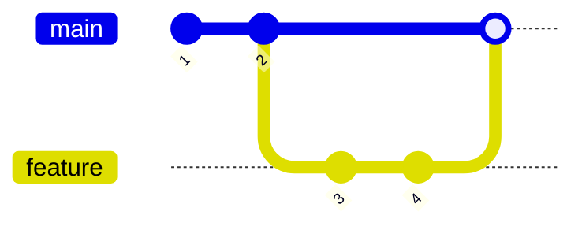
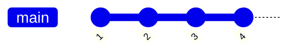
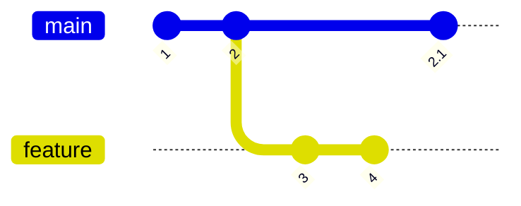
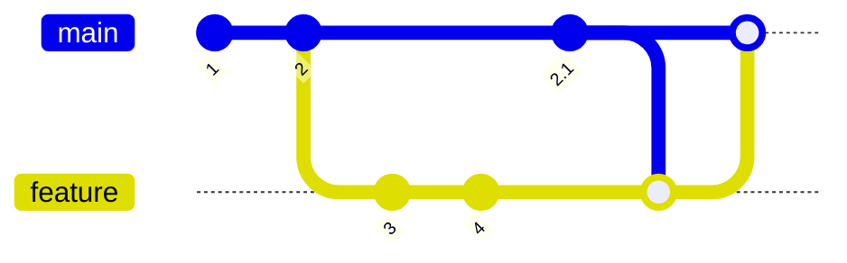
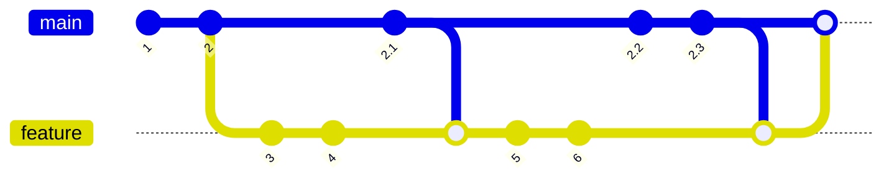
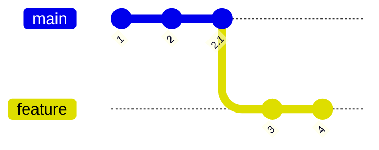
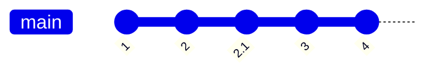
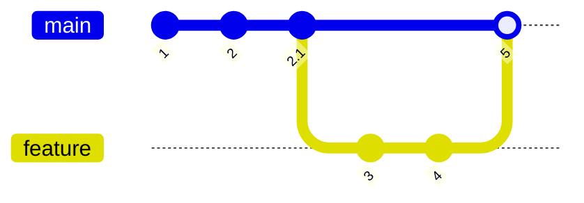

# git-scenarios

Git scenarios explained

## Merging a feature branch with main

In this scenario `main` has not been updated before our branch is merged.

When using github with git a PR will likely be created when the branch is ready for review.  Assuming the review is ok, it is merged with main:



Here we see a merge commit was created.  git/github may not always be configured to create a merge commit, by default `git` in this situation may do a fast forward.

If a fast forward occurs the above scenario would look like this following the merge.  The benefit of this is you have a slightly simpler history, but the disadvantage is that you lose the knowledge that commits 3 and 4 were distinct from 1 and 2.



## "Sync merges" Merging after main has moved (and then merging again with main)

In this scenario this happens and a new change labelled `2.1` occurs on the upstream branch:



If we were just to merge our PR directly with main via github, we'd potentially be just "hoping" the changes would work.  So you'll often see people in this scenario first merge `main` into their `feature` branch to get the upstream change, and then finally merge their feature branch with `main`:




If a feature takes a while to develop the history may end up looking like this as the sync merges are visible in the history.  



_In practice if this happens the history will likely look much messier than this, as those changes in `main` `2.1`, `2.2`, `2.3` are likely also merge commits (which may also have sync merges)_

Though accurate, this can make the history much harder to follow.

## Rebase and merge workflow

Here we assume the situation is as before, and `main` has a commit since we branched:


So what we should aspire to do after noticing this, is to make it look as if we didn't branch at `2` but instead branched after seeing `2.1`.  Assuming you have the `feature` branch checked out you can do this with the command `git rebase main`:



This will cause `git` to replay your commits one by one ontop of `2.1`.  If there are any conflicts (overlapping patches) it will stop and allow you to fix the conflicts up one by one.  This can be beneficial to pursuing a big merge, as git will tell you exactly what commits are introducing the conflicts.  A disadvantage is that you may end up having to resolve more conflicts than you might need to if you were doing a big merge; e.g. a conflicting commit could potentially have been reverted in a future commit on main.

Regardless learning this workflow is a good starting point to progressing with git, as it introduces the important ideas of caring about the commit history you are creating.  One thing you should aspire to do in this flow is to rewrite commits `3` and `4` so that they look as if they were aware of the changes in `2.1` all along.  Doing this will make your projects history much more valuable for the tasks of maintainance and review.

By default if we perform a 

```
$ git checkout main
$ git merge feature
```

git will perform a fast-forward merge, making the history appear completely linear: 




The disadvantage of this is that we lose information in the histories structure about where a feature begins and ends.  For this reason it can be useful
to instead merge with `--no-ff`:

```
$ git checkout main
$ git merge feature --no-ff
```

Which gives us a clean history like this, that clearly indicates the beginning and end of the feature work:


